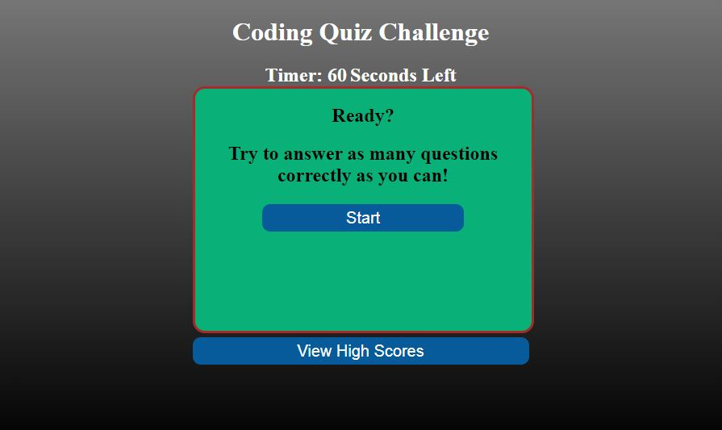
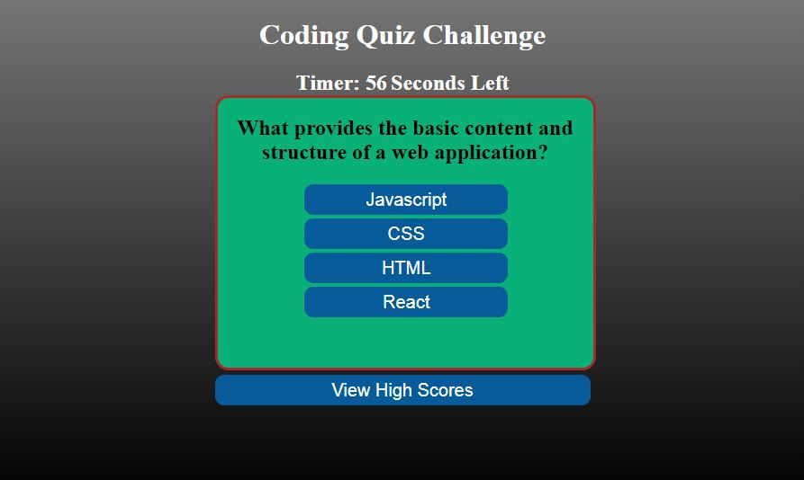

# Coding-Quiz

## Description

Coding Quiz Featuring JavaScript Fundamentals

For this project, I was tasked with creating a Coding Quiz that is created with dynamically generated HTML elements on the page, tracks the user's score, and stores high scores and names in local storage. The application has a countdown timer, and the ability to view the high scores from the start page.

## Link to deployed application:

https://mdschenck.github.io/Coding_Quiz/

## User Story for this project:

- AS A user interested in testing my coding knowledge
- I WANT to take a quiz with questions on coding basic knowledge that tracks my score
- SO THAT I can test my skills and compare my score with my classmates

## This deployment meets the acceptance criteria listed below:

- WHEN I click the start button,
  THEN I am presented with a running countdown timer, and a series of questions pulled from local storage and populated dynamically onto the page.
- WHEN the user gets an answer right,
  THEN a message will display that the answer was correct, and the user's score will increase.
- WHEN the user gets the answer wrong,
  THEN a message will display that the answer was incorrect.
- WHEN the user answers a question,
  THEN the quiz will move to the next question.
- WHEN all of the questions have been asked,
  THEN the final score will be displayed, along with an input form to enter the name for the high scores.
- WHEN the name is entered and submitted,
  THEN the high scores will be displayed.
- WHEN the View High Scores button is pushed from any page,
  THEN the high scores will be displayed.

## Application Use:

When the user navigates to the deployed page, they are presented with a start screen for the Coding Quiz.

When the user clicks the start button, the countdown timer starts running and they are presented with the first question.

As the user answers questions, they are presented with a message showing whether the answer was correct or incorrect. When they have answered all of the questions, the user's score will be displayed, along with a text input field to enter their name to score with their high score in local storage.

The high score is persistent in local storage and will continue to display until the local storage is cleared by hitting the clear high scores button.
